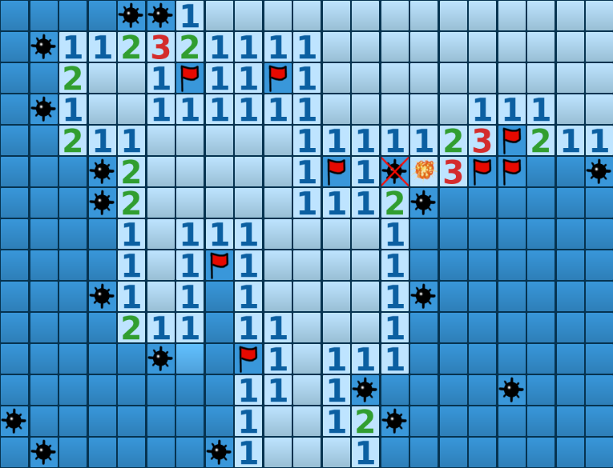

# Minesweeper
A Minesweeper implementation using ReactJS and Golang. This project is under development, thus the lacking documentation.

Why having a backend for minesweeper? I am working on a multiplayer session mode!

## Preview

